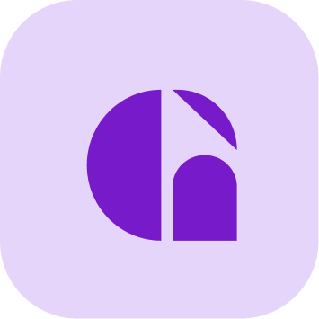

<p align="center">
  <a href="https://docs.mygateway.xyz/">
    
    <h3 align="center">Gateway Documentation</h3>
  </a>
</p>

<p align="center">
    Gateway Protocol is the world's first user-owned data-sharing protocol.
</p>

<p align="center">
  <a href="https://mygateway.xyz/"><strong>Gateway Protocol</strong></a> ·
  <a href="https://docs.mygateway.xyz/"><strong>Docs</strong></a> ·
  <a href="https://mygateway.xyz/blog"><strong>Blogs</strong></a>
</p>

## About

This application showcases how to integrate the Gateway Protocol into a Next.js application. You have the ability to connect user's wallet, issue them Personal Data Assets (PDAs), and ask for their consent to share their data with your application via a Data Request.

## Pre-requisites

- Getting API keys from [Gateway Protocol](https://mygateway.xyz)
- Node.js installed on your machine
- Filling in the `.env` file with your API keys, use the `.env.example` file as a template

## Getting Started

First, run the development server:

```bash
npm run dev
# or
yarn dev
# or
pnpm dev
# or
bun dev
```

Open [http://localhost:3000](http://localhost:3000) with your browser to see the result.
